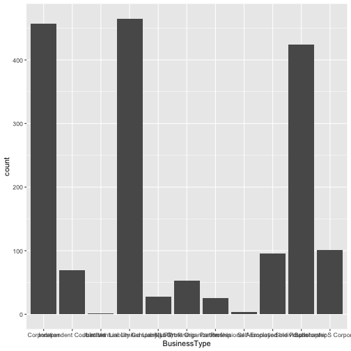

Developing Data Products
========================================================
author: Jefferson Bien-Aime
date:01/22/2021
autosize: true

Introduction
========================================================

This presentation is part of the Course Project for the Coursera Developing Data Products class. The peer assessed assignment has two parts. First, we need to create a Shiny application and deploy it on Rstudio's servers. Second, we should use Slidify or Rstudio Presenter to prepare a reproducible pitch presentation about the application. This presentation adresses the second part of the course project.

A summary of the PPP loan in Virgin Island
========================================================

During the Covid-19, The Trump Administration signed a bill that will allow small business to get a loan in order to support the payroll of their employee. A few weeks later, the Small Business Administration (SBA) has provided a report for all businesses that has loan. For privacy, the owner and the name of the business were not mentionned. The data is available to download at the following link : link to SBA.

For the current application, you can filter the number of Jobs Retaineds, Information about the gender of the owner, the loan amount and the veteran status. You should be able also to search based on the information you are looking for. 

DataSets
========================================================
The Data used in the app comes form the Small Business Administration. It contains the information regarding the loan amount, the zip code, the city, the gender of the owner and his veteran status, the bank that approved the loan and the date of approval.


```
   LoanAmount            City              State               Zip           
 Min.   :    42.92   Length:1724        Length:1724        Length:1724       
 1st Qu.:  6600.00   Class :character   Class :character   Class :character  
 Median : 16270.73   Mode  :character   Mode  :character   Mode  :character  
 Mean   : 29937.47                                                           
 3rd Qu.: 39908.49                                                           
 Max.   :149900.00                                                           
                                                                             
   NAICSCode      BusinessType       RaceEthnicity         Gender         
 Min.   :111332   Length:1724        Length:1724        Length:1724       
 1st Qu.:453220   Class :character   Class :character   Class :character  
 Median :541110   Mode  :character   Mode  :character   Mode  :character  
 Mean   :550938                                                           
 3rd Qu.:624223                                                           
 Max.   :999990                                                           
 NA's   :32                                                               
   Veteran           NonProfit          JobsRetained     DateApproved      
 Length:1724        Length:1724        Min.   :  0.000   Length:1724       
 Class :character   Class :character   1st Qu.:  1.000   Class :character  
 Mode  :character   Mode  :character   Median :  2.000   Mode  :character  
                                       Mean   :  5.048                     
                                       3rd Qu.:  6.000                     
                                       Max.   :100.000                     
                                       NA's   :4                           
    Lender               CD           
 Length:1724        Length:1724       
 Class :character   Class :character  
 Mode  :character   Mode  :character  
                                      
                                      
                                      
                                      
```

Plot by BusinessType
========================================================


